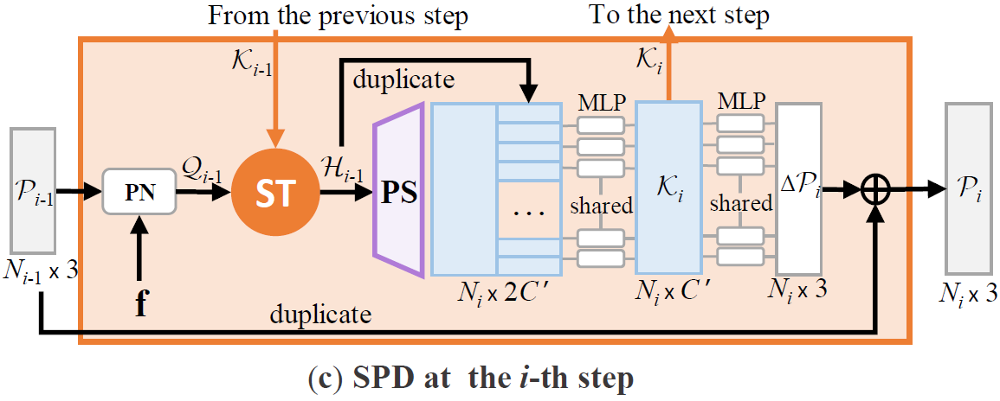

# Snowflake Point Deconvolution for Point Cloud Completion and Generation with Skip-Transformer (TPAMI 2022)

[Peng Xiang*](https://scholar.google.com/citations?user=Bp-ceOAAAAAJ&hl=zh-CN&oi=sra), [Xin Wen*](https://scholar.google.com/citations?user=7gcGzs8AAAAJ&hl=zh-CN&oi=sra), [Yu-Shen Liu](http://cgcad.thss.tsinghua.edu.cn/liuyushen/), [Yan-Pei Cao](https://scholar.google.com/citations?user=50194vkAAAAJ&hl=en), Pengfei Wan, Wen Zheng, [Zhizhong Han](https://h312h.github.io/)

[](pics/SPD.png)

## [NEWS]


- **2022-02 [NEW:tada:]** [SPD](https://arxiv.org/abs/2202.09367), the journal extension of SnowflakeNet, is accepted to [TPAMI 2022](https://ieeexplore.ieee.org/document/9735342). We have extended the application of snowflake point deconvolution to more generative tasks other than point cloud completion, including point cloud [auto-encoding](https://github.com/AllenXiangX/SnowflakeNet/tree/main/generation), [generation](https://github.com/AllenXiangX/SnowflakeNet/tree/main/generation), single view reconstruction ([SVR]((https://github.com/AllenXiangX/SnowflakeNet/tree/main/svr))), and point cloud upsampling ([PU]((https://github.com/AllenXiangX/SnowflakeNet/tree/main/PU))). This repository now contains the code of the ICCV paper and the extra contents of the extended version, including:

  - Point cloud completion on the [ShapeNet-34/21](https://github.com/AllenXiangX/SnowflakeNet/tree/main/completion/configs/shapenet34.yaml) dataset for [unseen class completion](https://github.com/yuxumin/PoinTr).
  - Point cloud completion on the PCN dataset evaluated under [EMD](https://github.com/AllenXiangX/SnowflakeNet/tree/main/completion/configs/pcn_emd.yaml) metric.
  - Point cloud auto-encoding and novel shape generation, see the [generation](https://github.com/AllenXiangX/SnowflakeNet/tree/main/generation) folder.
  - Single view reconstruction, seed the [svr](https://github.com/AllenXiangX/SnowflakeNet/tree/main/svr) folder.
  - Point cloud upsampling, see the [PU](https://github.com/AllenXiangX/SnowflakeNet/tree/main/PU) folder.

- **2021-10** [SnowflakeNet](https://openaccess.thecvf.com/content/ICCV2021/html/Xiang_SnowflakeNet_Point_Cloud_Completion_by_Snowflake_Point_Deconvolution_With_Skip-Transformer_ICCV_2021_paper.html) is published at [ICCV 2021](https://iccv2021.thecvf.com/), and the code is released!

## [SPD]

**1. Snowflake Point Deconvolution for Point Cloud Completion and Generation with Skip-Transformer (TPAMI 2022)**

**2. SnowflakeNet: Point Cloud Completion by Snowflake Point Deconvolution with Skip-Transformer (ICCV 2021, Oral)**

> Most existing point cloud completion methods suffer from the discrete nature of point clouds and the unstructured prediction of points in local regions, which makes it difficult to reveal fine local geometric details. To resolve this issue, we propose SnowflakeNet
with snowflake point deconvolution (SPD) to generate complete point clouds. SPD models the generation of point clouds as the
snowflake-like growth of points, where child points are generated progressively by splitting their parent points after each SPD. Our
insight into the detailed geometry is to introduce a skip-transformer in the SPD to learn the point splitting patterns that can best fit the
local regions. The skip-transformer leverages attention mechanism to summarize the splitting patterns used in the previous SPD layer
to produce the splitting in the current layer. The locally compact and structured point clouds generated by SPD precisely reveal the
structural characteristics of the 3D shape in local patches, which enables us to predict highly detailed geometries. Moreover, since
SPD is a general operation that is not limited to completion, we explore its applications in other generative tasks, including point cloud auto-encoding, generation, single image reconstruction, and upsampling. Our experimental results outperform state-of-the-art methods
under widely used benchmarks.

## [Cite this work]

```
@ARTICLE{xiang2022SPD,
  author={Xiang, Peng and Wen, Xin and Liu, Yu-Shen and Cao, Yan-Pei and Wan, Pengfei and Zheng, Wen and Han, Zhizhong},
  journal={IEEE Transactions on Pattern Analysis and Machine Intelligence}, 
  title={Snowflake Point Deconvolution for Point Cloud Completion and Generation with Skip-Transformer}, 
  year={2022},
  volume={},
  number={},
  pages={1-18},
  doi={10.1109/TPAMI.2022.3217161}}

@inproceedings{xiang2021snowflakenet,
  title={{SnowflakeNet}: Point Cloud Completion by Snowflake Point Deconvolution with Skip-Transformer},
  author={Xiang, Peng and Wen, Xin and Liu, Yu-Shen and Cao, Yan-Pei and Wan, Pengfei and Zheng, Wen and Han, Zhizhong},
  booktitle={Proceedings of the IEEE International Conference on Computer Vision (ICCV)},
  year={2021}
}
```

## [Getting Started]

#### Build Environment

```bash
# python environment
$ cd SnowflakeNet
$ conda create -n spd python=3.7
$ conda activate spd
$ pip3 install -r requirements.txt

# pytorch
$ pip3 install torch==1.7.1+cu110 torchvision==0.8.2+cu110 torchaudio==0.7.2 -f https://download.pytorch.org/whl/torch_stable.html
```


#### Build PyTorch Extensions
```
cd models/pointnet2_ops_lib
python setup.py install

cd ../..

cd loss_functions/Chamfer3D
python setup.py install

cd ../emd
python setup.py install
```

## Visualization of point splitting paths
We provide visualization code for point splitting paths in the *visualization* folder.


## Acknowledgements

Some of the code of this repo is borrowed from: 
- [GRNet](https://github.com/hzxie/GRNet), 
- [PoinTr](https://github.com/yuxumin/PoinTr),
- [diffusion-point-cloud](https://github.com/luost26/diffusion-point-cloud),
- [3DAttriFlow](https://github.com/junshengzhou/3DAttriFlow),
- [PUGAN](https://github.com/liruihui/PU-GAN),
- [pytorchpointnet++](https://github.com/erikwijmans/Pointnet2_PyTorch), 
- [ChamferDistancePytorch](https://github.com/ThibaultGROUEIX/ChamferDistancePytorch)
- [EMD](https://github.com/Colin97/MSN-Point-Cloud-Completion/tree/master/emd)


We thank the authors for their great job!

## License

This project is open sourced under MIT license.
