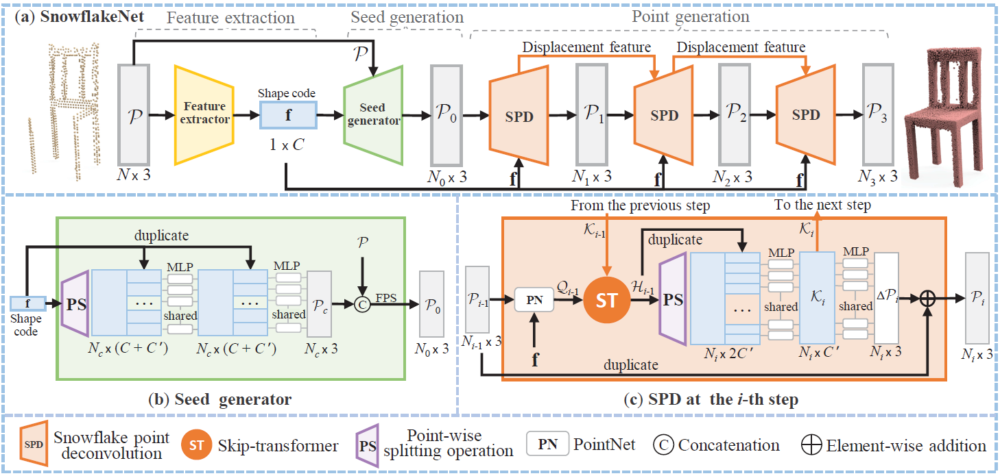

# SnowflakeNet: Point Cloud Completion by Snowflake Point Deconvolution with Skip-Transformer

[Peng Xiang](https://scholar.google.com/citations?user=Bp-ceOAAAAAJ&hl=zh-CN&oi=sra), [Xin Wen](https://scholar.google.com/citations?user=7gcGzs8AAAAJ&hl=zh-CN&oi=sra), [Yu-Shen Liu](http://cgcad.thss.tsinghua.edu.cn/liuyushen/), [Yan-Pei Cao](https://scholar.google.com/citations?user=50194vkAAAAJ&hl=en), Pengfei Wan, Wen Zheng, [Zhizhong Han](https://h312h.github.io/)

-----
This repository contains the source code for the paper [SnowflakeNet: Point Cloud Completion by Snowflake Point Deconvolution with Skip-Transformer](https://arxiv.org/abs/2108.04444) (ICCV 2021 Oral). The project page is [here](https://arxiv.org/abs/2108.04444).


## Cite this work

```
@inproceedings{xiang2021snowflakenet,
  title={{SnowflakeNet}: Point Cloud Completion by Snowflake Point Deconvolution with Skip-Transformer},
  author={Xiang, Peng and Wen, Xin and Liu, Yu-Shen and Cao, Yan-Pei and Wan, Pengfei and Zheng, Wen and Han, Zhizhong},
  booktitle={Proceedings of the IEEE International Conference on Computer Vision (ICCV)},
  year={2021}
}
```

[](pics/network.png)

## Datasets

We use the [PCN](https://www.shapenet.org/) and [Compeletion3D](http://completion3d.stanford.edu/) datasets in our experiments, which are available below:

- [PCN](https://drive.google.com/drive/folders/1P_W1tz5Q4ZLapUifuOE4rFAZp6L1XTJz)
- [Completion3D](https://completion3d.stanford.edu/)

The pretrained models on Completion3D and PCN dataset are available as follows:

- [SnowflakeNet_pre-trained](https://drive.google.com/drive/folders/1mdA-6ZwzXAbaWJ6fmfL9-gl3aGTGTWyR)

Backup Links:

- [SnowflakeNet_pre-trained](https://pan.baidu.com/s/10tkqJfMdWO9GkzXSBSNlIw) (pwd: oy5c)

#### Install Python Denpendencies

```
cd SnowflakeNet
pip install -r requirements.txt
```

#### Build PyTorch Extensions

**NOTE:** PyTorch >= 1.4 of cuda version are required.

```
cd pointnet2_ops_lib
python setup.py install

cd ..

cd Chamfer3D
python setup.py install
```

You need to update the file path of the datasets:

```
__C.DATASETS.COMPLETION3D.PARTIAL_POINTS_PATH    = '/path/to/datasets/Completion3D/%s/partial/%s/%s.h5'
__C.DATASETS.COMPLETION3D.COMPLETE_POINTS_PATH   = '/path/to/datasets/Completion3D/%s/gt/%s/%s.h5'
__C.DATASETS.SHAPENET.PARTIAL_POINTS_PATH        = '/path/to/datasets/ShapeNet/ShapeNetCompletion/%s/partial/%s/%s/%02d.pcd'
__C.DATASETS.SHAPENET.COMPLETE_POINTS_PATH       = '/path/to/datasets/ShapeNet/ShapeNetCompletion/%s/complete/%s/%s.pcd'

# Dataset Options: Completion3D, Completion3DPCCT, ShapeNet, ShapeNetCars
__C.DATASET.TRAIN_DATASET                        = 'ShapeNet'
__C.DATASET.TEST_DATASET                         = 'ShapeNet'
```


## Getting Started

To train SnowflakeNet, you can simply use the following command:

```
python main_*.py  # remember to change '*' to 'c3d' or 'pcn'
```

To test or inference, you should specify the path of checkpoint if the config_*.py file
```
__C.CONST.WEIGHTS                                = "path to your checkpoint"
```

then use the following command:

```
python main_*.py --test
python main_*.py --inference
```

## Visualization of point splitting paths
We provide visualization code for point splitting paths in the *visualization* folder.

## Acknowledgements

Some of the code of this repo is borrowed from [GRNet](https://github.com/hzxie/GRNet), [pytorchpointnet++](https://github.com/erikwijmans/Pointnet2_PyTorch) and [ChamferDistancePytorch](https://github.com/ThibaultGROUEIX/ChamferDistancePytorch). We thank the authors for their great job!

## License

This project is open sourced under MIT license.
