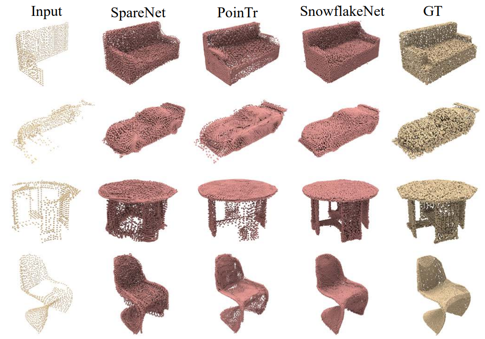

# Point Cloud Completion

This repository contains the source code for the papers:

1. Snowflake Point Deconvolution for Point Cloud Completion and Generation with Skip-Transformer (TPAMI 2023)

2. SnowflakeNet: Point Cloud Completion by Snowflake Point Deconvolution with Skip-Transformer (ICCV 2021, Oral)

[](../pics/completion.png)

## Datasets

We use the [PCN](https://www.shapenet.org/), [ShapeNet-34/21](https://github.com/yuxumin/PoinTr), and [Compeletion3D](http://completion3d.stanford.edu/) datasets in our experiments, which are available below:

- [PCN](https://drive.google.com/drive/folders/1P_W1tz5Q4ZLapUifuOE4rFAZp6L1XTJz)
- [ShapeNet-34/21](https://github.com/yuxumin/PoinTr/blob/master/DATASET.md)
- [Completion3D](https://completion3d.stanford.edu/)

## Getting Started

To use our code, make sure that the environment and PyTorch extensions are installed according to the instructions in the [main page](https://raw.githubusercontent.com/AllenXiangX/SnowflakeNet). Then modify the dataset path in the [configuration files](https://github.com/AllenXiangX/SnowflakeNet/tree/main/completion/configs).


## Training

To train a point cloud completion model from scratch, run:

```
python train.py --configs <config>
```

For example:

```
python train.py --configs ./configs/pcn_cd1.yaml
```

## Evaluation

To evaluate a pre-trained model, first specify the model_path in configuration file, then run:

```
python test.py --configs <config>
```

For example:

```
python test.py --configs ./configs/pcn_cd1.yaml
```

## Acknowledgements


This repo is based on: 
- [GRNet](https://github.com/hzxie/GRNet), 
- [PoinTr](https://github.com/yuxumin/PoinTr),

We thank the authors for their great job!