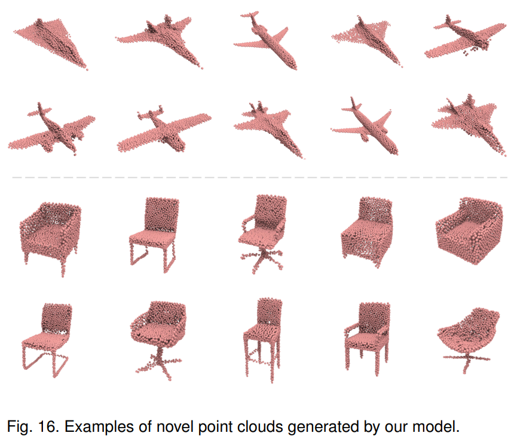

# Point Cloud Generation

This repository contains the source code of point cloud auto-encoding and generation of the papers:

1. Snowflake Point Deconvolution for Point Cloud Completion and Generation with Skip-Transformer (TPAMI 2022)

2. SnowflakeNet: Point Cloud Completion by Snowflake Point Deconvolution with Skip-Transformer (ICCV 2021, Oral)

[](../pics/generation.png)


## Datasets

We follow [diffusion-point-cloud](https://github.com/luost26/diffusion-point-cloud) and evaluate the point cloud generation quality of SPD on the ShapeNet dataset.

- [ShapeNet](https://drive.google.com/drive/folders/1SRJdYDkVDU9Li5oNFVPOutJzbrW7KQ-b)


## Getting Started

To use our code, make sure that the environment and PyTorch extensions are installed according to the instructions in the [main page](https://raw.githubusercontent.com/AllenXiangX/SnowflakeNet).


## Training

To train a point cloud generation model from scratch, run:

```
export CUDA_VISIBLE_DEVICES='0'

python train_ae.py # point cloud auto-encoding
# or 
python train_gen.py # point cloud generation
```


## Evaluation

To evaluate a pre-trained model, first specify the ckpt path, then run:

```
export CUDA_VISIBLE_DEVICES='0'

python test_ae.py # point cloud auto-encoding
# or 
python test_gen.py # point cloud generation
```

## Acknowledgements


This repo is based on: 
- [diffusion-point-cloud](https://github.com/luost26/diffusion-point-cloud)

We thank the authors for their great job!