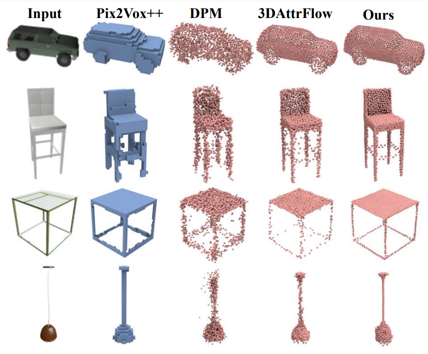

# Single View Reconstruction

This repository contains the source code of single view reconstruction and of the papers:

1. Snowflake Point Deconvolution for Point Cloud Completion and Generation with Skip-Transformer (TPAMI 2022)

2. SnowflakeNet: Point Cloud Completion by Snowflake Point Deconvolution with Skip-Transformer (ICCV 2021, Oral)

[](../pics/svr.png)

## Datasets

We follow [3DAttriFlow](https://github.com/junshengzhou/3DAttriFlow) and evaluate the single view reconstruction quality of SPD on the ShapeNet dataset.

- [ShapeNet](https://drive.google.com/drive/folders/1If_-t0Aw9Zps-gj5ttgaMSTqRwYms9Ag?usp=sharing)


## Getting Started

To use our code, make sure that the environment and PyTorch extensions are installed according to the instructions in the [main page](https://raw.githubusercontent.com/AllenXiangX/SnowflakeNet). Then modify the dataset path in the [configuration files](https://github.com/AllenXiangX/SnowflakeNet/tree/main/svr/cfgs).


## Training

To train a svr model from scratch, run:

```
python train_svr.py -c cfgs/SVR.yaml -gpu 0
```


## Evaluation

To evaluate a pre-trained model, first specify the "load_model" path in cfgs/SVR.yaml, then run:

```

python val_svr.py -c cfgs/SVR.yaml -gpu 0
```

## Acknowledgements

This repo is based on: 
- [3DAttriFlow](https://github.com/junshengzhou/3DAttriFlow)

We thank the authors for their great job!